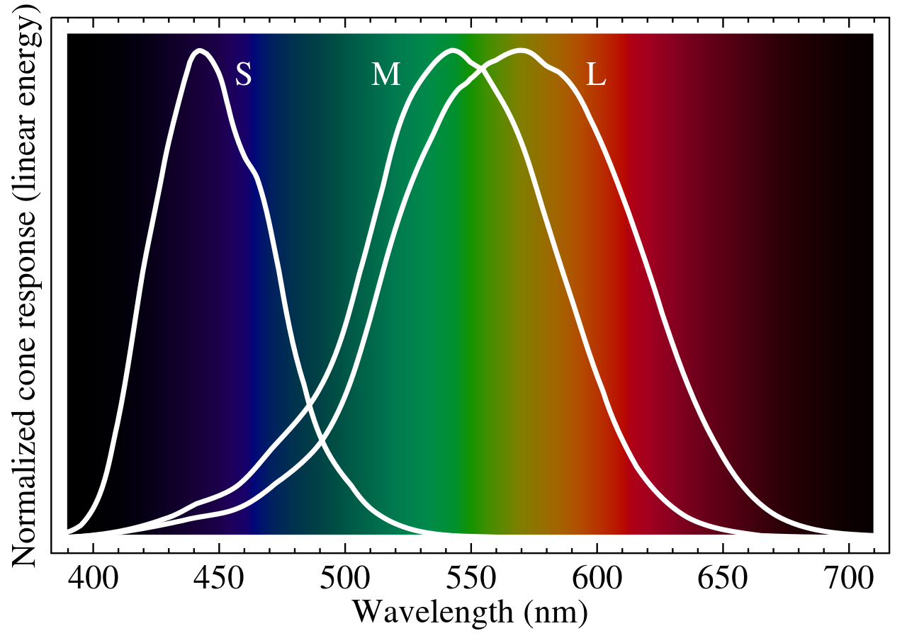

```{r setup, include=FALSE}
knitr::opts_chunk$set(echo = FALSE, message = FALSE)
library(ggplot2)
library(dichromat)
library(patchwork)
library(viridis)
library(RColorBrewer)
```


**Color blindness** or **color vision deficiency (CVD)** is the decreased ability to distinguish colors of differences between colors. The most common cause of color blindness is an inherited problem or variation in the functionality of one or more of the three classes of **cone cells** in the retina, which mediate color vision. We have three types of cone cells:

* **S-cones**, sensitive to short-wavelength light.
* **M-cones**, sensitive to medium-wavelength light.
* **L-cones**, sensitive to high-wavelength light.

The following figure shows the wavelengths perceived for each type of cone cells. M and L cones cover a similar range of wavelengths, so their malfunction leads to similar outcomes.

```{r, fig.align='center', fig.cap='Frequencies perceived by each cone cell type.'}

```


There are two useful classifications of color blindness, by severity and by the type of cone cells affected. Regarding **severity** we have:

* **Monochromacy** or total color blindness is the inability to see color. It can be rod monochromacy, caused by absence of cone cells in the retina, or cone monochromacy, caused by having a single type of functional cone cells. The only cone monochromacy described in the literature is **blue cone monochromacy**, caused by disfunction of L and M cones. 
* People with **dichromacy** can just see a mixture of two primary colors. This is caused by the malfunction of one type of cell cones.
* People with **trichromacy** have a less severe malfunction of one type of cone cells. Ranges from almost dichromacy (strong) to almost normal trichromacy (mild).

Regarding the affected cone, we can have three types of more or less severe color blindness:

* **Protan CVD** is the total (protanopia) or partial (protanomaly) disfunction of L-cones. Protan CVD affects 2% of males. For protans, the brightness of red is much reduced than for non-protanopes, to the extent that red traffic lights seem to be extinguished.
* **Deutan CVD** is the total (deuteranopia) or partial (deuteranomaly) disfunction of M-cones. Deutan CVD affects 6% of males. The experience of a deutan is similar to a protanope, without the extinction of high-wavelent light.
* **Tritan CVD** is the total (tritanopia) or partial (tritanomaly) disfunction of S-cones. Affects less than 0,01% of individuals. Tritans see short-wavelength colors as greenish and drastically dimmed.

Protan and deutan CVD is considered **red-green color blindness**, sometimes called  **daltonism**, as both have a hard time distinguishing between red and green. Tritan CVD is considered a **blue-yellow** color blindness.


## Impact of Color Blindness in a Visualization

The `dychromat` R package collapses red-green or green-blue distinctions to simulate
the effects of different types of color-blindness. We can use this package to examine if people with CVD can have a hard time distinguishing our color schemes.

Here I am presenting a visualization using the three primary colors, and how is it perceived by people affected by protan, deutan and tritan CVD.

```{r, echo=FALSE}

p1 <- ggplot(iris, aes(Sepal.Length, Sepal.Width, color = Species)) +
  geom_point(size = 2) +
  scale_color_manual(values = c("red", "green", "blue")) +
  labs(title = "Normal vision", x = NULL, y = NULL) +
  theme_minimal() +
  theme(legend.position = "none")

# Green-Blind (Deuteranopia)
p2 <- ggplot(iris, aes(Sepal.Length, Sepal.Width, color = Species)) +
  geom_point(size = 2) +
  scale_color_manual(values = dichromat(c("red", "green", "blue"), "deutan"))+
  labs(title = "Deuteranopia (Green Blindness)", x = NULL, y = NULL) +
  theme_minimal() +
  theme(legend.position = "none")

# protanopia (red blindness)
p3 <- ggplot(iris, aes(Sepal.Length, Sepal.Width, color = Species)) +
  geom_point(size = 2) +
  scale_color_manual(values = dichromat(c("red", "green", "blue"), "protan")) +
  labs(title = "Protanopia (Red Blindness)", x = NULL, y = NULL) +
  theme_minimal() +
  theme(legend.position = "none")

# tritanopia (blue blindness)
p4 <-ggplot(iris, aes(Sepal.Length, Sepal.Width, color = Species)) +
  geom_point(size = 2) +
  scale_color_manual(values = dichromat(c("red", "green", "blue"), "tritan")) +
  labs(title = "Tritanopia (Blue Blindness)", x = NULL, y = NULL) +
  theme_minimal() +
  theme(legend.position = "none")
```

```{r, out.width='100%', fig.height=7}
(p1 | p3) /
  (p2 | p4)
```

We observe how the simulation for protan and deutan is quite similar, as the red and blue colors are hard to distinguish for both. For tritan, the confusion is between green and blue.

## Diverging Brewer Scales

A usual resource to present a set of colors in visualizations are the diverging Brewer scales. Let's see how are they affected by each type of CVD.

```{r}
brew_names <-c("Spectral", "RdYlGn", "RdYlBu", "RdGy", "RdBu", "PuOr", "PRGn", "PiYG", "BrBG")

brew_normal <- function(x, n = 8){
  image(matrix(1:n, n, 1), col = brewer.pal(n=n, name = brew_names[x]), axes =FALSE, main = brew_names[x])
} 

brew_dichro <- function(x, n = 8, type = "deutan"){
  image(matrix(1:n, n, 1), col = dichromat(brewer.pal(n=n, name = brew_names[x]), type = type), axes =FALSE, main = paste0(brew_names[x], " - ", type))
} 
```

```{r, out.width='100%', fig.height = 9}
par(mfrow=c(9,4), mar = c(1,1,1,1))
f <- sapply(1:9, \(x){
  brew_normal(x, n = 8)
  brew_dichro(x, n = 8, type = "protan")
  brew_dichro(x, n = 8, type = "deutan")
  brew_dichro(x, n = 8, type = "tritan")
} )
```

We can see that some of these diverging scales are not convenient for protan and deutan, It is the case of `RdYlGn`, `RdGy` or `BrBG`. These should be avoided if needs of CVD people need to be taken into account.

## Viridis Scales

According to authors of the viridis scales, these help make "plots that are pretty, better represent your data, easier to read by those with colorblindness, and print well in gray scale".

Let's see how viridis scales are affected by each CVD.

```{r}
viridis_names <-c("magma", "inferno", "plasma", "viridis", "cividis", "rocket", "mako", "turbo")

vir_normal <- function(x, n = 50){
  image(matrix(1:n, n, 1), col = viridis(n=n, option = LETTERS[x]), axes =FALSE, main = viridis_names[x])
} 

vir_dichro <- function(x, n = 50, type = "deutan"){
  image(matrix(1:n, n, 1), col = dichromat(viridis(n=n, option = LETTERS[x]), type = type), axes =FALSE, main = paste0(viridis_names[x], " - ", type))
} 
```

```{r, out.width='100%', fig.height = 8}

par(mfrow=c(8,4), mar = c(1,1,1,1))
f <- sapply(1:8, \(x){
  vir_normal(x, n = 8)
  vir_dichro(x, n = 8, type = "protan")
  vir_dichro(x, n = 8, type = "deutan")
  vir_dichro(x, n = 8, type = "tritan")
} )

```

viridis scales seem to be less affected by CVD, remarkably viridis and cividis, although some loss of color variation is inevitable. Therefore, when presenting several colors in a plot, it is advisable to use the viridis scale family.

## References

* Cone cells <https://en.wikipedia.org/wiki/Cone_cell>
* Dichromacy <https://en.wikipedia.org/wiki/Dichromacy>
* Rudis, B.; Ross, N. & Garnier, S. (2021). *Introduction to the viridis color maps.* <https://cran.r-project.org/web/packages/viridis/vignettes/intro-to-viridis.html>
